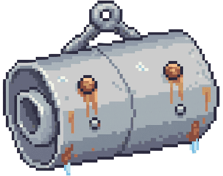

# Telefonen: hvem ringer, når — og slingredemparen
Forslag, ikke bygd. Skrevet av fire agenter med hver sin vinkel, syntetisert
og motprøvd mot koden. Alle linjenumre er verifisert mot fiske.html.

## Hovedfunnet er ikke en person. Det er en klokke.
Bygg RYTMA fyrst, ringjarane etterpå — og ikkje éin ny figur.

Den verkelege feilen i dag er ikkje at det manglar stemmer, men at klokka går feil veg: `iv.neste=Date.now()+9t` (L3993) ladar seg opp medan spelet er lukka, så han er ALLTID utgått når ungen opnar spelet. `investTilbod()` blir prøvd kvart 20. sekund, og einaste portane som står att er `phase==="idle"` og ingen open modal. Resultatet er at telefonen ringjer innan tjue sekund etter at han kjem seg på havet, før han har kasta ein gong — og den som spelar ti minutt om dagen får dermed høgast ringetettleik per spelt minutt. Fiks klokka til å telje HAVTID (`P.tidMs`), legg på ein innseglingsfred, ein fred rundt tap og rekordar, og eit døgntak. Då blir spelet roligare utan at eit einaste ord blir skrive.

Oppå det: fem anrop, alle frå folk som ALT finst i fila — Kjell, Odd, Ingrid, Rusten, Solveig. Dei deler den same døgnkvota som dei ti tilboda, så samla ringevolum aukar ikkje med eitt einaste anrop; det blir berre annleis fordelt. To av dei fem sel ingenting, éin varslar før straffa, éin peikar på ei klokke som alt tikkar, og éin er måten telefonen blir skrudd på att på spelaren sine premissar.

Ingen av dei nemner spilletid. Det næraste vi kjem er Ingrid som seier at ho sjølv går heim — og det er ein person, ikkje ein teljar.

## De fem som ringer

### Propell-Kjell på verkstaden. Finst alt, har stemme i openKjell(), bokmål, kort og praktisk.
**Når:** Når `P.svc` passerer 235 — femten kast før servicegrensa på 250 (L1573-1574), altså før havarisjansen hoppar frå 1/1500 til 1/60 (L1568). Éin gong per servicesyklus (flagg som blir nullstilt når P.svc=0 hos Kjell), verkstadtid kl. 09-17, og tidlegast 6 min havtid ut i økta. Ringjer utan `innLegg()` — sjå regel 7.

**Hvorfor:** Motorhavariet (L1568-1570) er den einaste staden spelet straffar hardt og brått. I dag kjem det som uflaks. Ein telefon femten kast før gjer det til noko du valde å oversjå — og skilnaden mellom uflaks og eiga skuld er heile skilnaden på om ein tiåring blir sint eller lærer noko. Notisen på L1575 seier alt dette, men han seier det som eit varsel. Kjell seier det som ein kar som høyrde deg køyre forbi.

> Det er Kjell. Jeg hørte motoren din da du gikk ut i dag. Den hakker på turtallet. Farlig er det ikke ennå. Men kjører du to uker til på den, står du der ute og ringer meg i stedet for å stikke innom. Bare så du vet det.

### Odd Mikkelsen, M/S Gamle Ola. Ein av dei ti. «Odd har uflaks. Men han kan sjøen.»
**Når:** 3-5 minutt havtid etter `snap()` (L1866) på ein fisk i øvre halvdel av lengdespennet sitt, eller på eit trofé. Maks éin gong kvar fjortande dag. Et av døgnkvota på to anrop. SMS-vindauget hans skal ikkje ha lott-knappar — berre «Takk».

**Hvorfor:** Dette er det anropet som kalibrerer alle dei andre. I dag er telefonen éin kanal med eitt innhald: pengar. Kjem det eit tilbod tjue sekund etter at ungen mista kveita si, les det som hån — spelet kom for å be om pengar i det sekundet du mista noko. Éin telefon som ikkje vil ha noko gjer at dei ni andre sluttar å vere kredittkortsluk. Og fordi han et av same kvota, kostar han ingenting i volum.

> Det er Odd. Eg skal ikkje spørje om noko i dag. Eg berre sat her og tenkte på ei kveite eg rauk snøret på i fjor haust. Ho står der framleis, veit du. Dei går ingen stad.

### Ingrid Sund, M/S Måken. Yngst av dei ti, minste båten. «Ingrid går korte turer. Lav risiko, lav gevinst.»
**Når:** Når `tidSum(P,Date.now()) > 100 min` (havtid i dag, teljaren finst alt på L2708), blir det SISTE anropet i døgnkvota bytt ut med Ingrid i staden for eit tilbod. Ikkje eit ekstra anrop — ei utskifting. Maks éin gong per døgn. Ingen lott-knappar.

**Hvorfor:** Dette er heile svaret på «har spelt for lenge», og det inneheld ikkje eit einaste ord om tid. Ingen teljar, ingen skjerm som seier stopp, ingen formaning, ingen som er skuffa. Berre eit menneske ungen ser opp til som seier at han har fått det han skulle ha. Ein tiåring kan le av det og halde fram — eller la vere. Begge deler er greitt, og det er nettopp difor det verkar.

> Ingrid her. Jeg er på vei inn. Jeg går aldri lenger enn til Måkeskjæret, jeg — fem timer, så har jeg fått det jeg skulle ha. Vi ses ute i morgen.

> Ingrid. Jeg snur nordover nå. Det står fisk igjen der ute, det gjør det alltid. Den blir stående til i morgen, den også.

### Rusten i butikken. Nynorsk, tørr, folkeleg kunnskap — same stemma som RUSTEN_ORD (L1621).
**Når:** Når ei teine i `P.pots.out` har `setAt` eldre enn 40 timar. Kl. 08-20, maks éin gong per døgn, aldri om du alt har trekt ei teine same dagen, og aldri same døgn som Kjell. Ringjer utan `innLegg()`.

**Hvorfor:** Teinene har ei ekte klokke som går medan du gjer noko anna (`setAt`, L2294), og dei blir gløymde — det er den eine tingen i spelet som stille sløser bort spelaren si tid. Eit menneske som seier «eg såg blåsa di frå kaia» gjer at du hugsar ho, og gjer øya mindre, fordi nokon står på land og ser båten din. Dette er òg den einaste av dei fem som gir deg pengar tilbake same dag.

> Det er Rusten. Eg såg blåsa di frå kaia i dag tidleg. Ho har lege der i tre døgn no. Det som står i ei teine så lenge, et opp kvarandre, gut. Dra ho før straumen tek henne.

### Solveig Åsen, M/S Fjordperle. «Solveig holder bruket i orden. Det lønner seg over tid.»
**Når:** Tre nei på rad utan eit ja (ny teljar `iv.neiRad`, nullstilt i `investJa()`) slår AV heile ringinga. Meldingane held fram med å kome i innboksen som før, og prikken tikkar. Telefonen blir slått på att fyrst når spelaren sjølv opnar ei melding i `apneMelding()` (L4162) — og då er Solveig den som ringjer, tidlegast 10 minutt havtid etterpå.

**Hvorfor:** I dag betyr «Nei takk» berre at den fiskaren blir litt sjeldnare i eit lotteri (L3985); telefonen ringjer like ofte. Ungen har ingen måte å seie «ikkje no, eg fiskar» på. Når tre nei gir ekte stille, og spelaren sjølv slår det på igjen ved å opne innboksen, er telefonen noko han STYRER i staden for noko som skjer med han. Solveig og den tikkande prikken er ikkje pynt — dei er sikringa som gjer at ingen kan låse seg ute for godt.

> Det er Solveig på Fjordperle. Jeg så du hadde lest meldingene igjen. Vi går ut torsdag hvis været står. Du bestemmer helt selv — jeg maser ikke på deg.

## Reglene — terskler og vakter, konkret nok til å kodes

1. KLOKKA SKAL TELJE HAVTID. Byt `iv.neste=Date.now()+9*3600000` (L3993) mot eit mål på `P.tidMs`: nytt felt `iv.nesteTid`, og `investTilbod()` sjekkar `P.tidMs < iv.nesteTid` i staden for `Date.now() < iv.neste`. Ei nedkjøling som går medan mobilen ligg i lomma er alltid utgått når spelet blir opna — det er den einaste grunnen til at telefonen ringjer etter tjue sekund i dag.

2. INNSEGLINGSFRED: ingen telefon dei fyrste 6 minutta havtid av ei økt. Krev ein ny minne-variabel `oektMs` inne i setInterval-en som alt finst på L2678 (`P.tidMs` er total og `P.dager[dagKey()]` er per døgn — ingen av dei veit kor lenge du har site samanhengande). Nullstillast når `#sea` ikkje er open, eller når `document.hidden` har vore sann fire tikk på rad (1 min). At `oektMs` forsvinn ved reload er rett veg å bomme: den som lastar sida på nytt får freden på nytt.

3. MINST 12 MINUTT HAVTID MELLOM KVART ANROP, uansett kven som ringjer. `investSjekk()` og `investTilbod()` ligg i den same 20-sekundspulsen (L2673) og veit ikkje om kvarandre i dag, så eit resultatanrop og eit nytt tilbod kan lande 20 sekund frå kvarandre. Resultatanropet har alltid forkøyrsrett; tilbodet ventar. TAK: maks 2 anrop per døgn talt med `dagKey()`, og dei fem nye deler kvota med dei ti fiskarane.

4. FRED RUNDT HØGDEPUNKT OG TAP: ingen ring dei fyrste 90 sekunda etter `land()` av rekord- eller freda fisk, og 60 sekunda etter `snap()`/`escape()`. Både `snap()` (L1866) og `escape()` (L1859) set `phase="idle"` med ein gong og opnar ingen modal — så `ringKlar()` (L4057) er sann, og telefonen KAN ringje midt i skuffelsen i dag. Denne regelen må inn samstundes med havtidsklokka: sjeldnare anrop veg tyngre, så eit dårleg tidspunkt blir verre, ikkje betre.

5. INGEN AV DEI FEM SEL NOKO. Kjell si åtvaring gir ingen rabatt på servicen. Odd, Ingrid og Solveig sine samtalar skal ikkje ha lott-knappar i `visSms()` — berre «Takk». Rusten ber ikkje om pengar. Heller ingen skal gi pengar, fisk, tid eller framdrift: blir eit anrop verdt kroner, sluttar det å handle om folk og blir ein mekanikk å optimalisere.

6. INNBOKSEN TÅLER IKKJE FRAMANDE AVSENDARAR. Både `visInnboks()` (L4141) og `apneMelding()` (L4163) gjer `var f=fiskerVed[m.fk]; if(!f)return;` — ei Rusten- eller Kjell-melding ville telje som ulest på den raude prikken og aldri kunne opnast. Kjell og Rusten ringjer difor UTAN `innLegg()`; blir anropet ubesvart, kjem det berre ein `notice()`. Dei tre fiskarane (Odd, Ingrid, Solveig) held fram med `innLegg()` FØRST, så ingenting går tapt.

7. STILLE OM KVELDEN: etter kl. 21 lokal tid skal `Snd.ringtone` gå frå volum 0.5 til 0.2 (L973) og `navigator.vibrate` frå [180,120,180,120,180] til éin støyt på 120 ms (L4066). Ein telefon som ringjer på fullt volum halv elleve på eit barnerom er eit problem i den verkelege verda, ikkje i spelet. Ingen tekst skal nemne klokka.

8. RUSTEN OG KJELL MAKS ÉIN GONG PER DØGN KVAR, OG ALDRI SAME DØGN. To menn som ber deg gjere noko med båten på same ettermiddag les som ein pengesekk med ringjelyd, ikkje som ei bygd. Kjell skal heller ikkje ringje same døgn som havneavgift-purringa på L1577.

## Hva som ble forkastet, og hvorfor
HEIMEFRONTEN — heile bolken (Bjørg med middagen, Bjørg som kjeftar etter tre timar, Bjørg om natta, Mia på 7 som ikkje får sove, Vetle på 14, mor med svele). Dette er den vakrast skrivne av dei fire buda, og det er difor det er farlegast. Fire grunnar til nei:
(1) Det er spelet som spelar forelder. «Middagen står på komfyren» og «no har eg ete åleine» sagt til ein tiåring som fiskar, er ei formaning same kor lun ho er — og det er nøyaktig det som ikkje skal skje. Ingrid som seier at HO går heim er den same medisinen utan pekefingeren.
(2) Det finn opp ein familie spelaren ikkje har valt. Spelet blir spelt av heile familien; å plassere ei kone på kjøkkenet og to ungar i senga tildeler roller nokon ikkje har bede om.
(3) Seks nye figurar for null mekanikk, og fire av dei snakkar innanfor ein halvtime av kvarandre.
(4) Den einaste teksten som eigentleg vil noko — Vetle sin SMS etter eit dyrt kjøp — kan ikkje visast i innboksen slik han er bygd (regel 6).

BODØ RADIO, NAVIGASJONSVARSELET OG REDNINGSSKØYTA. Det finaste språket i heile bunken, og det som er lettast å ta feil. Radioen er ikkje ein ringjar — han er stemning, og `notice()` er ei enkelt luke (L1462) som ville skrive over fangstnotisen om han kjem 200 ms etter `land()`. I Nordland melder MET regn og vind halve året, så «maks ein gong per økt» blir framleis kvar dag. Om noko av dette skal inn seinare, er det kulingvarselet aleine, som `notice()`, med lagra døgnflagg og sjekka mot `vxKode()` i same sekund teksten blir vist. Redningsskøyta fell fordi Kjell no varslar FØR havariet — ei stemme etter er ei stemme for mykje.

LINE PÅ MOTTAKET («bilen går klokka seks»). Dette er ein telefon som ber deg fiske MEIR dei neste to timane. Motsett veg av alt anna i forslaget, og det kolliderer med Rustens dagsbestilling (L1494).

ROALD HAMNESJEF. Sjarmerande, men det er ein annan mann som vil ha pengar for båten. Purre-notisen på L1577 er tørr, og det er heilt greitt at ho er det.

ASTRID OG KVALEN / KÅRE OG STRAUMEN. Dei to beste av dei forkasta, og dei næraste ja-et. Astrid som stadfestar at ho såg den same kvalen er første gongen nokon i spelet stadfestar noko spelaren har opplevd åleine. Men kvar av dei kostar eit anrop av to i døgnet, og dei gir ikkje spelaren noko han kan handle på. Ta dei opp att om eit halvt år, når rytma har fått setje seg og familien saknar noko.

KORTARE SMS FRÅ FJERDE TUREN (`f.kjapp`). Rett diagnose — `skrivUt()` brukar 17 ms per teikn, så ein åtte-linjers SMS et sju sekund — men det krev ti nye tekstar, og med havtidsklokka og døgntaket ser familien langt færre tilbod i året enn i dag. Vent til teksttrøyttleiken faktisk melder seg.

---

# Slingredemparen

**Navn:** Slingredempar  ·  **Pris:** 12000 kr

**Virkning:** KODEVERDIEN: `tRise` i reelStep, fiske.html L1823 — `var tRise = 3.4*f.pull;` (spenn opp per sekund når du held sveiven). Dette er talet som åleine avgjer snap(), for snap() blir utløyst av `tension>=100` (L1856). Ingenting i spelet rører dette talet i dag.

ENDRINGA: legg til éi linje rett etter L1823:
  if(P.demper) tRise *= 0.75;   // slingredemparen: 25 % roligare stigning i spennet
`tFall` (16) og `reelSec` skal IKKJE rørast.

KVA DET GJER I SEKUND (netto hald før snøret ryk, frå spenn 0):
- Kveite, pull 3.2: 10,88 → 8,16 % per sekund. 9,2 s → 12,3 s. Under utras (×1.8): 5,1 s → 6,8 s.
- Håkjerring, pull 3.4: 11,56 → 8,67. 8,7 s → 11,5 s.
- Håbrann 2.8: 9,52 → 7,14. 10,5 s → 14,0 s.
- Makrellstørje 2.9: 9,86 → 7,40. 10,1 s → 13,5 s.
- Torsk, pull 1.0: 3,40 → 2,55. 29 s → 39 s (spelaren merkar det ikkje — han når aldri taket).
- Sandflyndre, pull 0.5: 59 s → 78 s. Ingen praktisk skilnad.
Effekten treffer altså av seg sjølv berre den store fisken på Dypt og Djuphavet, utan noko `if(depth...)` i koden.

DET SOM IKKJE BLIR ENDRA (og som må stå slik):
- Kampen blir ikkje kortare. `reelSec` er urørt, så demparen overlappar ikkje med turbosnella (`reelSec*=0.5`, L1821) eller superagnet (L1822). Dei tre kan stablast utan å bli same vara.
- `tFall=16` er urørt, så slepp-fasen kjenst nøyaktig lik. Rytmen familien har i fingrane blir ikkje broten.
- escape() (`slackT>3`, L1855) er urørt. Gjev du for mykje slakk, glepp fisken like fort som før.
- Utrasfrekvens, `runPow`, `prog` og størje-kapringa er urørte.

LAGRING OG SYNK — nytt flagg `P.demper`, må inn fem stader elles forsvinn kjøpet ved synk mellom telefonar:
1. L1329 (ved sida av `if(P.turbo==null)P.turbo=false;`): `if(P.demper==null)P.demper=false;`
2. L1197 eksportpakka: legg `demper:P.demper,` inn i lista med `vinsj, ekko, turbo`.
3. L1172 importfletting: `if(np.demper)lp.demper=true;`
4. L1209: `["vinsj","ekko","turbo"]` → `["vinsj","ekko","turbo","demper"]`
5. L1200 nybegynnarsjekken: legg til `&& !lp.demper`.

BUTIKKOPPFØRINGA (i openShop, «Utstyr»-fana, rett over turbosnella L2877, same mønster):
  if(!P.demper&&P.rod>=2) addShop(L,' Slingredempar',"To tunge plater ute på kvar side som held båten roleg i sjøgangen — spennet stiger 25 % saktare, så storfisken sliter seg sjeldnere.",12000,false,function(){P.demper=true; notice("Slingredemparane er ute — båten står som ei brygge ⚖️");});
Krav `P.rod>=2` (Stang III) gjer at han fyrst dukkar opp når spelaren faktisk har fisk å miste.

**Rustens butikktekst:**

> «Det er ikkje fisken som ryk snøret, gut — det er båten som rullar; med demparane ute står du roleg nok til å halde lenger.»

**Navneforslagene som ble vurdert:**

- **Slingredempar** — ANBEFALT. Ekte utstyr: tunge plater som heng i bommar ute på kvar side av båten og bremsar rullinga i sjøgang (kallast òg paravanar eller flopperstoppar på norske båtar). Det er eigarens eige ord, det passar Rusten i munnen, og forklaringa er sann både i verkelegheita og i koden: mindre rulling = mindre rykk = spennet stig saktare. Kostar ekte pengar, så 12 000 kr er truverdig.

- **Bremseskive** — Skiva i snella som slepper ut litt line før snøret ryk — mekanisk er dette det aller mest presise namnet på det koden faktisk gjer. Trekk frå: ein tiåring høyrer «bil», og namnet er så nært «turbosnelle» at dei to varene lett blir forveksla i hylla.

- **Fjørblokk** — Ekte blokk med fjør som lina går gjennom; ho tek brådraget når fisken kastar seg. Kort, konkret og lett å teikne på 18 piksler. Trekk frå: mindre kjent ord, og det ser lite ut — vanskeleg å ta 12 000 kr for.

- **Gummistrekk** — Strikken fiskarar set inn på teinetau og fortøying for å ta rykket. Varmt, folkeleg og noko Rusten kunne sagt utan å blunke. Trekk frå: det HØYRES billeg ut. Ein gummistrekk til 12 000 kr trur ingen på, så namnet ville tvinge prisen ned dit vara blir for lett å få tak i.

- **Strekkforfang** — Eit mjukt forfang av tjukk nylon mellom line og sluk som strekkjer seg og et opp rykket. Ekte og riktig. Trekk frå: spelaren har alt sluker og agn i hovudet, og eit «forfang» blir lett forveksla med dei — han vil leite etter det under fana Sluker.

**Bildeprompt:**

16-bit pixel art of a Norwegian boat roll-damper plate (paravane / flopper-stopper), seen hanging at a slight three-quarter angle. A heavy delta-shaped galvanised steel plate with a folded leading edge and four visible rivets, hanging from a short length of thick chain and a shackle at the top. Weathered zinc grey and pewter with rust-orange streaks down the plate and a few pale salt marks; a couple of seawater drips at the lower tip. Chunky and simple — it must read clearly as one heavy hanging plate on a chain at 18 pixels high, so no fine detail, no rope, no boom, no boat, no text. Strict pixel grid, hard-edged pixels, no anti-aliasing, no gradients — ordered dithering only. Limited 24-colour palette. Fully transparent background, no shadow, no outline glow. Approx 300 × 380 px, file spill/assets/slingredempar.png

**Vurdering:**

SLINGREDEMPAR, 12 000 kr, krav `P.rod>=2`. Ja til forslaget som det står — og eg har sjekka koden sjølv.

Namnet er eigarens eige ord, det er ekte utstyr (tunge plater i bommar ute på kvar side som bremsar rullinga i sjøgang), det kostar ekte pengar så 12 000 er truverdig, og det kan forklarast til ein tiåring på éi setning: båten rullar mindre, så det blir mindre rykk i snøret. Dei fire andre fell: «bremseskive» høyrest ut som bil og ligg for nær turbosnella i hylla, «fjørblokk» og «strekkforfang» blir forveksla med sluker og forfang spelaren alt har i hovudet, og «gummistrekk» høyrest for billeg ut til å kunne kosta 12 000.

Verknaden er rett stad å røre. `var tRise = 3.4*f.pull;` (L1823) er det einaste talet i kampen som ingenting i spelet rører i dag — ei tom hylle. `if(P.demper) tRise *= 0.75;` rett etter, og ingenting anna. Kveita går frå 9,2 til 12,3 sekund samanhengande hald før snøret ryk; torsken går frå 29 til 39 og spelaren merkar det ikkje, for han når aldri taket. Effekten treffer difor storfisken på Dypt og Djuphavet heilt av seg sjølv, utan ein einaste `if(depth...)` — ingen skjulte terningar, og butikkteksten kan love nøyaktig det koden gjer.

`tFall=16` (L1824) skal ikkje rørast: slepp-fasen må kjennast identisk, elles bryt vi muskelminnet familien har i fingrane (fila åtvarar mot dette sjølv, L2684-2685). `reelSec` skal heller ikkje rørast — turbosnella (30 000, L1821) og superagnet (L1822) halverer begge kamptida, og ein dempar som gjer det same ville vore ein billegare turbosnelle. Turbo = raskare, dempar = tryggare. Dei to stablar utan å ete kvarandre.

Rustens butikktekst er god: «Det er ikkje fisken som ryk snøret, gut — det er båten som rullar; med demparane ute står du roleg nok til å halde lenger.» Sjølve vareteksten må framleis seie talet: spennet stig 25 % saktare.

FELLA: eg har verifisert dei fem lagringsstadene, og forslaget har rett. `P.demper` må inn i default (L1329, ved sida av `if(P.turbo==null)P.turbo=false;`), i `gearUt()` (L1197, saman med `vinsj, ekko, turbo`), i importflettinga (L1172), i `gearLoft()` der `["vinsj","ekko","turbo"]` står (L1209), og i `gearFersk()` (L1200, som i dag les `!lp.vinsj && !lp.turbo && !lp.ekko`). Gløymer du éin av dei, forsvinn eit kjøp på 12 000 kr stille neste gong familien synkroniserer mellom to telefonar.

---

# Idébank: flere apper på telefonen (dommerpanel 5. aug 2026)

MERK: nr. 5 «Notatboka» UTGÅR — eieren besluttet samme kveld at Rustens råd
bor i Arkivet → Min bok, ikke på telefonen.

{'summary': 'Idéarbeid: hvilke apper hører hjemme på telefonen i fiskespillet', 'agentCount': 4, 'logs': [], 'result': '# Dommens topp 6 — apper til telefonen\n\nAlle tre listene er enige om kjernen: appene skal være **pull, ikke push** (PLAN-TELEFONEN.md), gjenbruke data som alt finnes i `P` og MET-kallene, og bestå testen «har en ekte fisker på 66,87° N dette på telefonen?». Dubletter er slått sammen: vær (3 forslag), tidevann (3), tipsarkiv (2), radio (2), teiner/regelverk (2), prisliste (2).\n\n## 1. Flo & fjære\n**Pitch:** Kartverkets tidevannstabell — fire klokkeslett og en kurve, så strømmen kan planlegges i stedet for bare avleses.\n**Viser:** Høy-/lavvann i dag, kurve, spring/nipp, «no: fell ut, god straum».\n**Data:** `stromNaa()` (L3319) — klokkeslettene er ren aritmetikk på M2-sinusen. **Kost: liten.**\n**Hvorfor:** Billigste app med størst spillverdi — strøm er «største enkeltfaktoren i saltvann», og alle tre listene foreslo den. Barnet lærer å lese tabellen; den voksne planlegger kveitevinduet.\n\n## 2. Været — frå Meteorologisk institutt\n**Pitch:** Yr i lomma slik den faktisk ser ut: tre tørre linjer, et symbol, og farevarsel bare når det gjelder.\n**Viser:** Nå + i kveld, vind (nytt!), sol og måne, kulingbanner kun ved `uvaerNaa()`.\n**Data:** `seaWx`/`vxKode()`, `solTid`, `maaneFase`; tre gratisfelt til fra compact-svaret (L5236). **Kost: liten.**\n**Hvorfor:** Spillets ekte-data-sjel fortjener en skjerm — man sjekker den på hytta for spillet OG virkeligheten. Tetter vind-hullet i fiksjonen. Torden er det kuleste åtteåringen vet.\n\n## 3. Vekta — familierekordtavla\n**Pitch:** Rekordene som alt synkes via Netlify Blobs, hengt opp i lomma på hver spiller.\n**Viser:** Største fisk per art med navn og dato, familiens fem største, «slo pappa med 3 cm»-linjer.\n**Data:** Blobs-rekordene, uendret. **Kost: liten.**\n**Hvorfor:** Stolthetsappen. Rivalisering uten chattefelt — barnet ser navnet sitt daglig, den voksne sjekker i smug. Mest kos per byggetime av alle.\n\n## 4. Fritidsfiske — frå Fiskeridirektoratet\n**Pitch:** Den ekte appen norske fritidsfiskere må ha: fredningsregler, sesonger og «mine reiskap ute» — byråkratisk og nettopp derfor troverdig.\n**Viser:** Freda arter, sesongstatus (hummer!), og hver teine/line med ståtid — grønn/gul/rød mot 40-timersgrensen.\n**Data:** `fredetNaa()` (L2734), `hummerSeason()`, `P.pots.out[].setAt` (L2294), `lineAgn`. **Kost: liten–middels.**\n**Hvorfor:** Slår sammen «Blåsa» og regeloppslaget og løser to ting på én gang: glemte teiner (PLAN-TELEFONENs «stille tidssløseri») blir synlige uten mas, og ungen kan slå opp at pigghå er freda FØR Rusten kjefter. Kontrasten stat/kai er gratis krydder.\n\n## 5. Notatboka — Rustens tips\n**Pitch:** Fisketipsene fra 7-lappers syklusene slutter å forsvinne og blir en bok man blar i.\n**Viser:** Hver opptjent lapp i Rustens nynorsk, datert; utjente vises som tomme linjer.\n**Data:** `P.tips` (L1579), lappe-stylingen fra L252. **Kost: liten.**\n**Hvorfor:** I dag er tipsene et skattekart man mister. Barnet blar i den som hemmelig bok; den voksne slår faktisk opp («hva sa han om håbrann og måne?»). Samlingen drar mot neste bestilling helt uten poeng-mekanikk.\n\n## 6. Kanal 16 — VHF-loggen\n**Pitch:** Bodø Radio gjenfødt som logg — problemet var aldri stemmen, det var at den ringte.\n**Viser:** 4–5 døgnsoppføringer: kulingvarsel, fiskere som melder posisjon i sin egen målform (`mal`-feltet), Birger som «seier ikkje meir på telefonen».\n**Data:** `vxKode()`, `FISKERE` (L5995), `iv.tur`. **Kost: middels** (20–30 tekstmaler).\n**Hvorfor:** Dyrest av de seks, men den som gjør Saltvær til et samfunn — de ti fiskerne finnes i dag bare når de vil ha penger.\n\n## Resten av idébanken\n- **Skjellsandkula** — daglig orakel på nynorsk, vektet av vær og måne; familiens favoritt, sterk kandidat til plass 7.\n- **Prislista** — mottakets prisliste pluss dagens bestillingslapp; frø for premium-dagspriser.\n- **Havna** — oppslagstavle med `P.havnNeste`-forfall og «funne: eitt par vottar».\n- **Telegrammet** — automatiske familietelegram ved rekorder («STOPP»); krever synk-hendelser.\n- **Albumet** — automatiske minnebilder fra store øyeblikk; mest ny grunn.\n- **Loggboka** — én linje per dag på havet; krever utvidet `P.dager`.\n- **Almanakken** — månedskalender per art; delvis dekket av Fritidsfiske.\n\n**Byggerekkefølge:** 1→2→3 kan tas på hver sin kveld; 4 og 5 er helgejobber; 6 til slutt, når telefonen fortjener en stemme.', 'workflowProgress': [{'type': 'workflow_phase', 'index': 1, 'title': 'Idéer'}, {'type': 'workflow_phase', 'index': 2, 'title': 'Syntese'}, {'type': 'workflow_agent', 'index': 1, 'label': 'ide:mekanikk', 'phaseIndex': 1, 'phaseTitle': 'Idéer', 'agentId': 'a5ad3470854e605f5', 'model': 'claude-fable-5', 'state': 'done', 'startedAt': 1785934721635, 'queuedAt': 1785934717705, 'attempt': 1, 'lastToolName': 'Bash', 'lastToolSummary': 'grep -nE "flo|fjære|fjaere|fase\\(|maanefase|månefase|moonPh…', 'promptPreview': 'Spillet «Jakten på storkveita» (fiskespillet.no) er et koselig norsk pikselkunst-fiskespill for en familie (barn og voksne). Spilleren ror ut fra Saltvær, fisker på fire felt (Kvitholmen 0-50m, Trålsund 50-150m, Svartrenna 150-300m, Uthavet 300-500m), leverer daglige bestillinger til butikkeieren Rusten (7-lappers sykluser med fisketips som belønning), setter krabbe-/hummerteiner og bunnliner som …', 'lastProgressAt': 1785934851153, 'tokens': 66563, 'toolCalls': 4, 'durationMs': 129518, 'resultPreview': 'Jeg har lest koden (fiske.html) og PLAN-TELEFONEN.md for å forankre forslagene i det som faktisk finnes. Her er forslagene, rangert etter verdi per byggekost.\n\n## Apper til telefonen — rangert etter verdi-per-byggekost\n\n### 1. «Blåsa» — bruksappen\n**Pitch:** Alt som står i sjøen mens du gjør noe annet, samlet på én skjerm — så teinene slutter å bli glemt.\n**Viser/gjør:** Én rad per teine og bunnli…'}, {'type': 'workflow_agent', 'index': 2, 'label': 'ide:familie', 'phaseIndex': 1, 'phaseTitle': 'Idéer', 'agentId': 'a178c0d0fa9ecfc10', 'model': 'claude-fable-5', 'state': 'done', 'startedAt': 1785934721245, 'queuedAt': 1785934717705, 'attempt': 1, 'lastToolName': 'Read', 'lastToolSummary': '/Users/kjetilsande/Documents/Claude/Fiskespillet/PLAN-TELEF…', 'promptPreview': 'Spillet «Jakten på storkveita» (fiskespillet.no) er et koselig norsk pikselkunst-fiskespill for en familie (barn og voksne). Spilleren ror ut fra Saltvær, fisker på fire felt (Kvitholmen 0-50m, Trålsund 50-150m, Svartrenna 150-300m, Uthavet 300-500m), leverer daglige bestillinger til butikkeieren Rusten (7-lappers sykluser med fisketips som belønning), setter krabbe-/hummerteiner og bunnliner som …', 'lastProgressAt': 1785934870533, 'tokens': 65722, 'toolCalls': 2, 'durationMs': 149288, 'resultPreview': 'Jeg har lest PLAN-TELEFONEN.md og OVERLEVERING-4-AUG.md for å unngå dubletter (Meldinger og Tråleren finnes; fangstbok, troféskap og toppliste bor andre steder). Her er familiens ønskeliste, ordnet etter hvor mye kos per byggetime.\n\n---\n\n## 1. Kystvarslet (værmelding, tidevann og måne)\n\n**Pitch:** Alt spillet allerede VET om himmelen og sjøen, samlet på én skjerm du kan planlegge etter.\n\n**Innhold…'}, {'type': 'workflow_agent', 'index': 3, 'label': 'ide:verden', 'phaseIndex': 1, 'phaseTitle': 'Idéer', 'agentId': 'a130954bad23cef0d', 'model': 'claude-fable-5', 'state': 'done', 'startedAt': 1785934721991, 'queuedAt': 1785934717705, 'attempt': 1, 'lastToolName': 'Bash', 'lastToolSummary': 'grep -n "Notater\\|appNot" fiske.html | head; echo ---FISKAR…', 'promptPreview': 'Spillet «Jakten på storkveita» (fiskespillet.no) er et koselig norsk pikselkunst-fiskespill for en familie (barn og voksne). Spilleren ror ut fra Saltvær, fisker på fire felt (Kvitholmen 0-50m, Trålsund 50-150m, Svartrenna 150-300m, Uthavet 300-500m), leverer daglige bestillinger til butikkeieren Rusten (7-lappers sykluser med fisketips som belønning), setter krabbe-/hummerteiner og bunnliner som …', 'lastProgressAt': 1785934925887, 'tokens': 77601, 'toolCalls': 6, 'durationMs': 203895, 'resultPreview': 'Jeg har lest koden — `fiske.html` (fiskevaeret/tavla L4344, MET-kallene L3302/L3388/L5236, stromNaa L3319, fredetNaa L2734, FISKERE L5995-6066, telefonen L6321) og hele PLAN-TELEFONEN.md, inkludert hvorfor Bodø Radio ble forkastet som *ringer*. Her er forslaget.\n\n# Seks apper til telefonen i «Jakten på storkveita»\n\nPrinsipp fra PLAN-TELEFONEN.md som gjelder alle: appene er PULL, ikke push. Ingen a…'}, {'type': 'workflow_agent', 'index': 4, 'label': 'syntese', 'phaseIndex': 2, 'phaseTitle': 'Syntese', 'agentId': 'ac47d12311375c5bc', 'model': 'claude-fable-5', 'state': 'done', 'startedAt': 1785934929562, 'queuedAt': 1785934927420, 'attempt': 1, 'promptPreview': 'Her er tre idélister for nye apper på in-game-telefonen i «Jakten på storkveita»:\n\nJeg har lest koden (fiske.html) og PLAN-TELEFONEN.md for å forankre forslagene i det som faktisk finnes. Her er forslagene, rangert etter verdi per byggekost.\n\n## Apper til telefonen — rangert etter verdi-per-byggekost\n\n### 1. «Blåsa» — bruksappen\n**Pitch:** Alt som står i sjøen mens du gjør noe annet, samlet på én …', 'lastProgressAt': 1785934996005, 'tokens': 60076, 'toolCalls': 0, 'durationMs': 66443, 'resultPreview': '# Dommens topp 6 — apper til telefonen\n\nAlle tre listene er enige om kjernen: appene skal være **pull, ikke push** (PLAN-TELEFONEN.md), gjenbruke data som alt finnes i `P` og MET-kallene, og bestå testen «har en ekte fisker på 66,87° N dette på telefonen?». Dubletter er slått sammen: vær (3 forslag), tidevann (3), tipsarkiv (2), radio (2), teiner/regelverk (2), prisliste (2).\n\n## 1. Flo & fjære\n**…'}], 'totalTokens': 269962, 'totalToolCalls': 12}